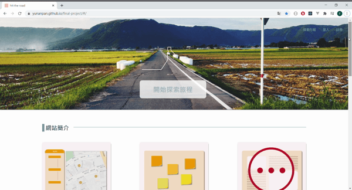
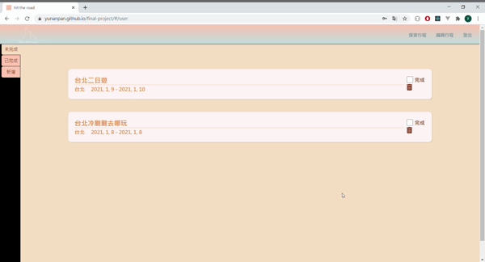
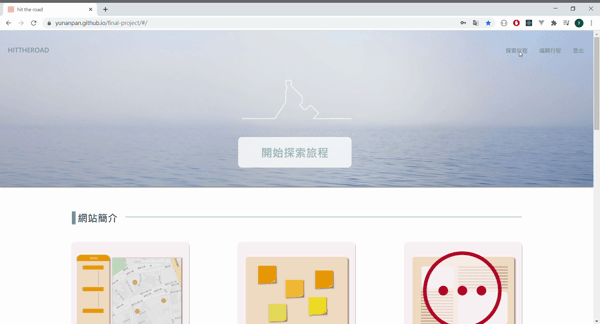

# hit the road (RWD)

hit the road 主要是以 React 所建立的行程規劃專案，結合 Google Maps 和便利貼功能，讓使用者可以先簡單紀錄必去的景點清單，再將景點排進行程欄中。在行程欄中可以依據不同交通方式計算各景點間的交通時間，有助於在行程規劃初期可以快速預估每個景點停留的時間和整體行程的規劃。另外也可以查看其他使用者已完成的行程，作為下次旅遊的行程參考。後端部分是以 Express + Sequelize 開發。

## DEMO

[hit the road 網址請點我](https://yunanpan.github.io/final-project/#/)

如果不想註冊，可以用測試帳號登入使用：

```
帳號：demo01
密碼：demo01
```

註：請勿隨意刪除非自己所建立之行程。

## 功能說明

- user-page

  - 新增、刪除行程
  - 選擇行程是否已完成

- planning-page

  - 在地圖上釘選景點並加入到便利貼中
  - 新增、刪除、編輯每日行程景點景點
  - 新增、刪除、編輯便利貼
  - 將便利貼景點排入每日行程中
  - 計算行程景點的交通方式與距離
  - 新增、刪除交通資訊
  - 儲存行程

- explore-page
  - 查看其他人已完成的行程

**登入**

- 登入後即可建立規劃行程。也可以利用右上角的 fb 圖示，以 facebook 帳號登入(須先註冊 facebook 帳號)。

  

**管理行程**

- 在 `/user` 可以新增、刪除行程與選擇行程是否已完成。

  

**規劃行程**

- 在 `/user` 點選新增，填寫行程名稱、地點與時間。

  

- 填寫好後會進入 `/planning-page` 頁面。在此可以利用搜尋功能，找到想去的地點後，釘選至地圖上並自動新增至便利貼區域

  

- 可以新增、修改便利貼內容。

  
  

- 將想排在同一天的景點便利貼，拖曳至行程欄中。拖曳進行程欄的便利貼就不能再移動，以提醒此便利貼的景點已經排在行程當中了。將在行程欄中的景點刪除，該景點的便利貼就可以再被拖曳。

  

- 在行程欄中，可以新增、刪除、修改景點資訊，也可以設定出發與離開的時間（預設的開始與結束時間皆為當日 0 時）。

  

- 點選目的地與出發地後，點選交通工具與出發時間，按下計算便可查看交通方式與時間。確定後便可將交通方式與時間加進行程欄中。

  

- 透過交通時間可以再去調整評估各景點間的出發、抵達與停留時間。

- 點選畫面左上角的 SAVE 按鈕以儲存目前所規劃之行程。

  

**參考其他人的行程**

- 透過首頁的探索行程，訪客或有登入的使用者皆可以查看已完成的行程。

  

**其他**

- 便利貼和地圖釘選是互相連動的。
- 可以直接新增便利貼和行程。
- 計算交通方式可能會遇到路線有問題，可以將地點改為附近的地標重新計算。
- 建議所選之日期選擇近一點的日期。

## libraries

- [react-day-picker](http://react-day-picker.js.org)
- [react-beautiful-dnd](https://github.com/atlassian/react-beautiful-dnd)
- [google-map-react](https://github.com/google-map-react/google-map-react)
- GoogleMaps / Place
- Redux Toolkit
- React Router
- styled-component

## 後端

- [後端 GitHub 原始碼頁面](https://github.com/ianchen6501/HIT-THE-ROAD-server)
- 後端系統是以 Express + Sequelize 開發。
